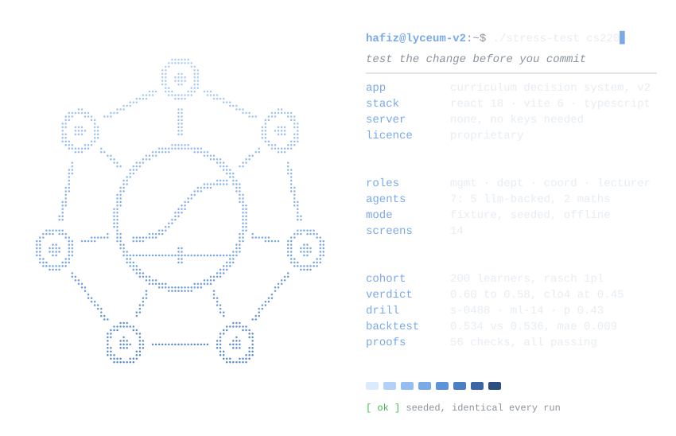
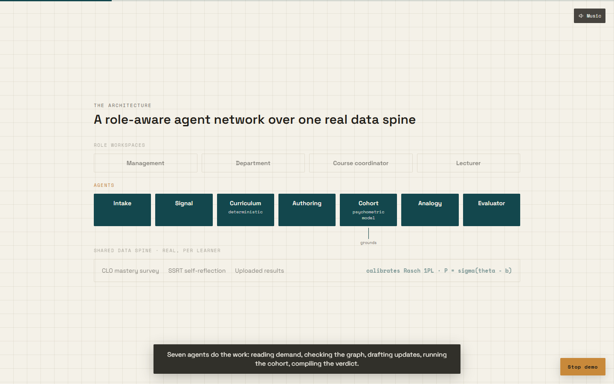
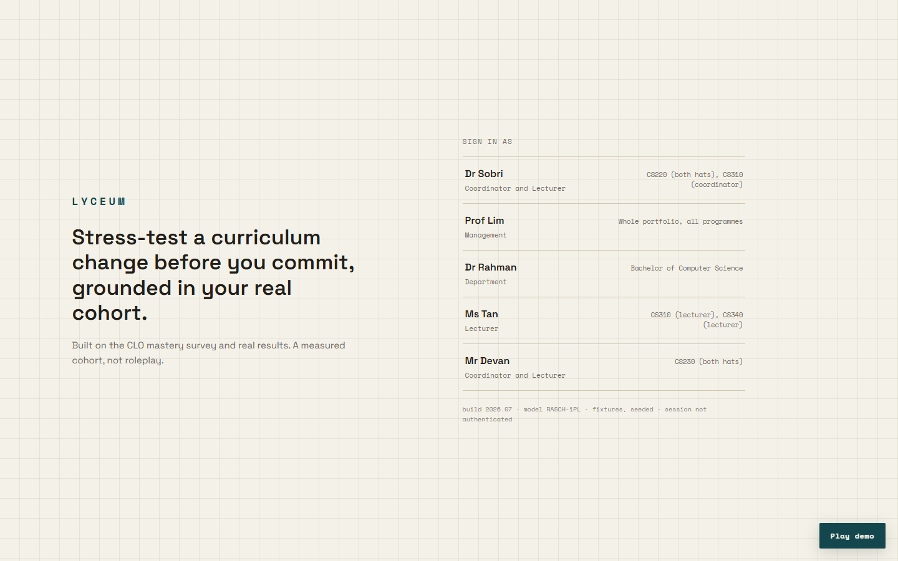
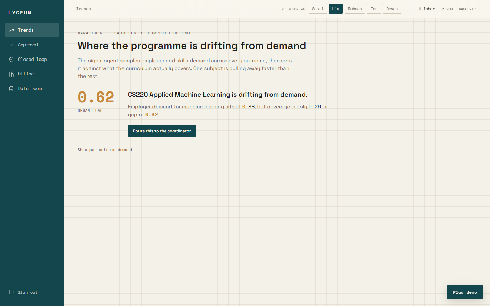
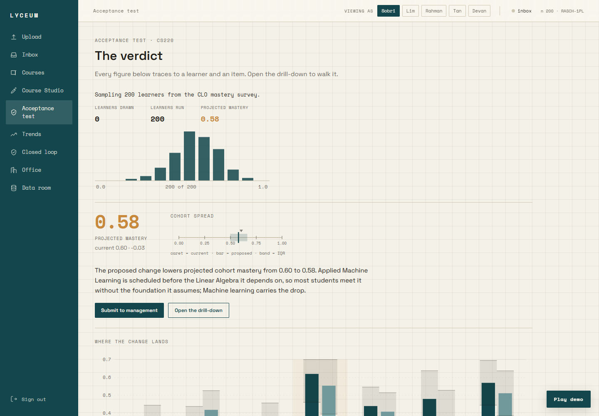
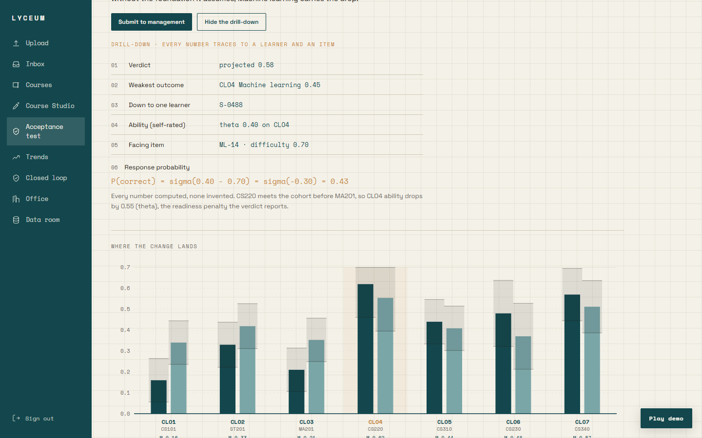
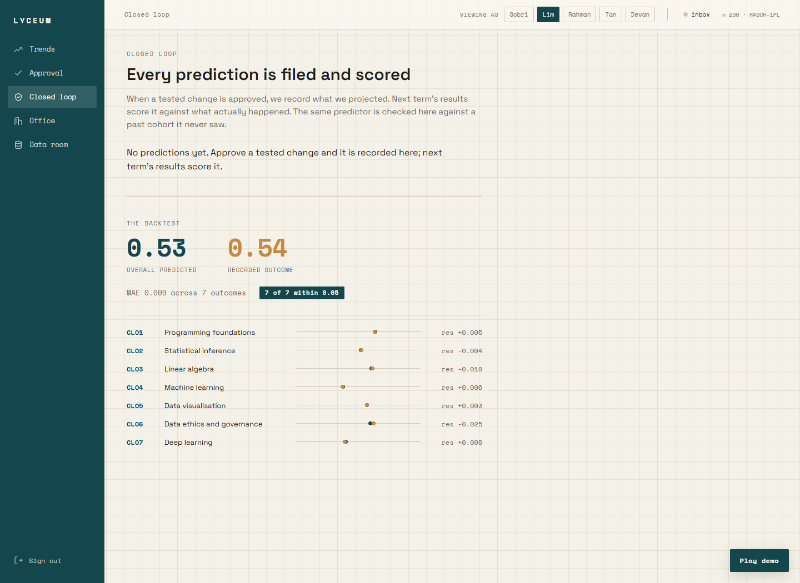
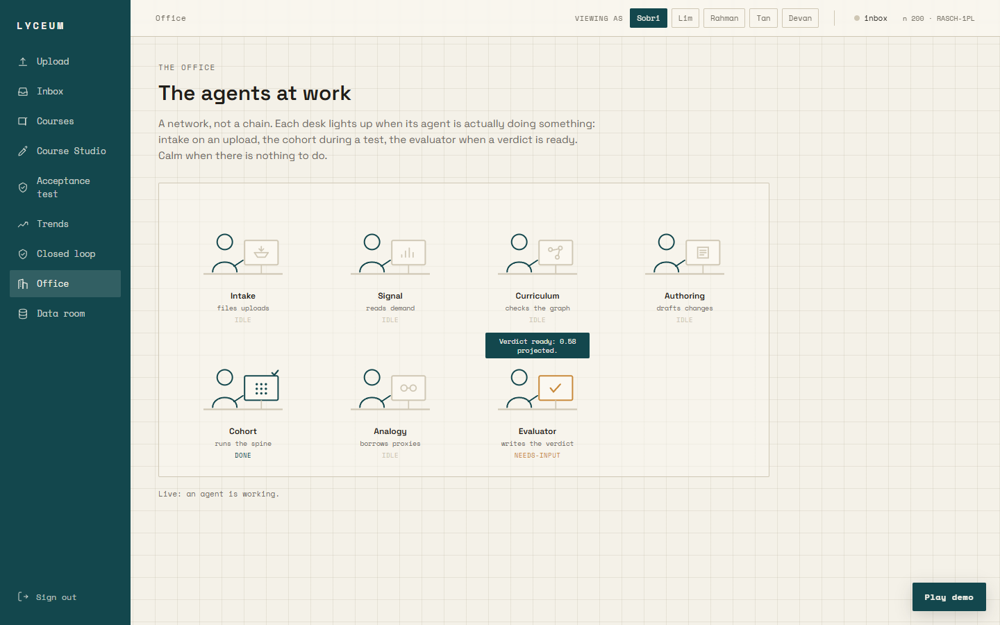

<div align="center">
  <picture>
    <source media="(prefers-color-scheme: dark)" srcset=".github/readme/banner-dark.svg">
    <source media="(prefers-color-scheme: light)" srcset=".github/readme/banner-light.svg">
    
  </picture>
</div>

<div align="center">
  <picture>
    <source media="(prefers-color-scheme: dark)" srcset=".github/readme/card-dark.svg">
    <source media="(prefers-color-scheme: light)" srcset=".github/readme/card-light.svg">
    
  </picture>
</div>

<p align="center">
  <a href="#hafizlyceum-v2-npm-run-dev"></a>
  <a href="#hafizlyceum-v2-cat-worked-example"></a>
  <a href="#hafizlyceum-v2-npm-run-proveall"></a>
</p>

```text
hafiz@lyceum-v2:~$ cat ./about
stress-test a curriculum change before you commit, grounded in your
real cohort. a role-aware, multi-agent decision system over a rasch 1pl
psychometric spine. a measured cohort, not roleplay.

hafiz@lyceum-v2:~$ node -p "(1/(1+Math.exp(-(0.40-0.70)))).toFixed(2)"
0.43
```

### <samp>hafiz@lyceum-v2:~$ open ./architecture</samp>

Lyceum is a role-aware, multi-agent decision system for curriculum change. A
department runs a degree; coordinators and lecturers propose changes to
subjects; the system stress-tests each change against the real cohort before
anyone commits, and records a prediction that next term's results will score.
Every verdict traces to a real learner and a real item, and the model grades
its own homework with a backtest.

Built on the CLO mastery survey and real results, calibrating a Rasch 1PL
psychometric model, with React 18, TypeScript and Vite 6. A measured cohort,
not roleplay.

<p align="center">
  
</p>

### <samp>hafiz@lyceum-v2:~$ cat ./why</samp>

- **Seven agents, one workflow.** They read employer demand, draft the update,
  test it against your real cohort, and compile the verdict. A network, not a
  chain. Five are LLM-backed (Intake, Signal, Authoring, Analogy, Evaluator);
  two are deterministic maths (the Cohort agent's Rasch model, the Curriculum
  agent's prerequisite graph).
- **Grounded, and it proves it.** Every number traces down to a single learner
  and a single item. In the worked example the drill-down lands on `P = 0.43`.
- **A closed loop.** Approving a change records a prediction; next term's
  results score it. The same predictor is validated against a held-out past
  cohort: predicted `0.534` against a real `0.536`, mean error `0.009`.
- **Reproducible by design.** Seeded, offline, identical every run. The five
  LLM agents ship with a `fixture | live` switch; this build runs the fixture
  path, so it needs no keys and reproduces exactly. Live mode wires them to an
  LLM.

### <samp>hafiz@lyceum-v2:~$ cat ./worked-example</samp>

CS220 (Applied Machine Learning) is scheduled before its prerequisite MA201
(Linear Algebra). Lyceum measures what that does to the cohort.

| quantity | value |
|:--|:--|
| Current cohort mastery | 0.60 |
| Projected cohort mastery | 0.58 |
| Weakest outcome | CLO4 Machine learning, 0.45 |
| Sequencing conflict | one: CS220 depends on MA201 |
| Drill-down | learner S-0488, theta 0.40, item ML-14 at b 0.70, P = sigma(0.40 - 0.70) = 0.43 |
| Backtest | predicted 0.534 vs actual 0.536, MAE 0.009, 7 of 7 within 0.05 |

### <samp>hafiz@lyceum-v2:~$ ls ./screens</samp>

<table>
  <tr>
    <td width="50%"><samp>sign in: who runs the degree, with their scope</samp></td>
    <td width="50%"><samp>trends: the drift, cs220 gap 0.62</samp></td>
  </tr>
  <tr>
    <td></td>
    <td></td>
  </tr>
  <tr>
    <td><samp>acceptance test: projected mastery 0.58</samp></td>
    <td><samp>drill-down: down to p = 0.43</samp></td>
  </tr>
  <tr>
    <td></td>
    <td></td>
  </tr>
  <tr>
    <td><samp>closed loop: mean error 0.009</samp></td>
    <td><samp>the office: desks light up as agents work</samp></td>
  </tr>
  <tr>
    <td></td>
    <td></td>
  </tr>
</table>

### <samp>hafiz@lyceum-v2:~$ cat ./ARCHITECTURE</samp>

```text
Layer 0   Data model   the contract every page and agent obeys   src/types.ts
Layer 1   Spine        cohort + Rasch link, pure maths, no LLM   src/lib/spine/
Layer 2   Agents       functions over the Layer 0 shapes         src/agents/
Layer 3   App and UI   store, roles, shell, role-aware screens   src/app/, src/ui/
Layer 4   Demo         the self-driving, self-narrating video    src/demo/
```

- **The data spine (real ground).** The CLO mastery survey and the SSRT
  self-reflection survey, per learner, calibrating the Rasch 1PL link
  `P = sigma(theta - b)`.
- **Roles and permissions.** Management, department, coordinators and
  lecturers, with per-subject hats. A lecturer's draft cannot reach management
  without coordinator review; management approves, the department does not;
  only academics with a hat on a subject can author or run its test.
- **The proposal flow.** `drafting` to `coordinator-review` to `testing` to
  `management-approval` to `approved`, enforced as a state machine, with pings
  routed between the waiting parties at every step.

### <samp>hafiz@lyceum-v2:~$ npm run dev</samp>

Requirements: Node.js 20 or newer (the proof scripts run TypeScript directly
on Node 22+) and a modern browser. No backend, no server, no API keys to run
this build.

```bash
npm install
npm run dev        # dev server at http://localhost:5173
npm run build      # production build into dist/
npm run preview    # serve the production build
npm run typecheck  # tsc --noEmit
```

### <samp>hafiz@lyceum-v2:~$ npm run prove:all</samp>

The maths and the flows are covered by deterministic proof scripts (no UI):

```bash
npm run prove          # the spine and the canonical numbers (12 checks)
npm run prove:backtest # the closed-loop backtest (4 checks)
npm run prove:flow     # store, roles, state machine, analogy, closed loop (28 checks)
npm run prove:signal   # the Signal staged reveal, lands CS220 / CLO4 gap 0.62 (12 checks)
npm run prove:all      # all of the above (56 checks)
```

### <samp>hafiz@lyceum-v2:~$ npm run smoke</samp>

A single **Play demo** control (bottom right of the app) runs the whole thing
end to end with a simulated cursor: setup and environment cards, the
architecture beat, then the full walkthrough over the real app, narrated by
captions and a soft ambient soundtrack. It needs no manual input.

```bash
npm run build
npm run preview        # then open the URL and click "Play demo"
npm run smoke          # headless: play the demo and assert the end state
```

Drop your own royalty-free `public/demo-music.mp3` to replace the built-in
generated track.

### <samp>hafiz@lyceum-v2:~$ tree -L 2</samp>

```text
src/
  types.ts                     the Layer 0 data contract
  config.ts theme.ts index.css knobs, design tokens, the graph-paper canvas
  lib/spine/                   the reused Rasch spine (pure maths)
  agents/                      the seven agents (fixture | live)
  app/                         store, roles, staged simulations
  ui/                          shell, primitives, charts, role-aware screens
  demo/                        the self-driving video (script, runner, segments)
scripts/                       generators and headless verification
docs/screenshots/              the images in this README
```

Every screen and agent is covered by deterministic proof scripts and a headless
demo smoke, so the numbers above are reproducible on any machine.

### <samp>hafiz@lyceum-v2:~$ ls ../lyceum*</samp>

| version | repo | what it is |
|:--|:--|:--|
| v2 | `hafizmnazman/lyceum-v2` (this repo) | The role-aware, multi-agent decision system: stress-test a change against the cohort before anyone commits |
| v3 | [`hafizmnazman/lyceum`](https://github.com/hafizmnazman/lyceum) | The curriculum advisory built on this spine: multi-source demand, real document intake, a public Relevance Index and a self-scoring loop |

### <samp>hafiz@lyceum-v2:~$ cat ./LICENSE</samp>

Copyright (c) 2026 Hafiz Azman. All rights reserved.

This is proprietary software. No permission is granted to use, copy, modify, or
distribute it without the express prior written permission of the author. See
[LICENSE](LICENSE) for the full terms.

<sub>The banner and card are generated by <code>.github/readme/build.py</code> (standard library Python). Change a value at the top and run it again.</sub>
